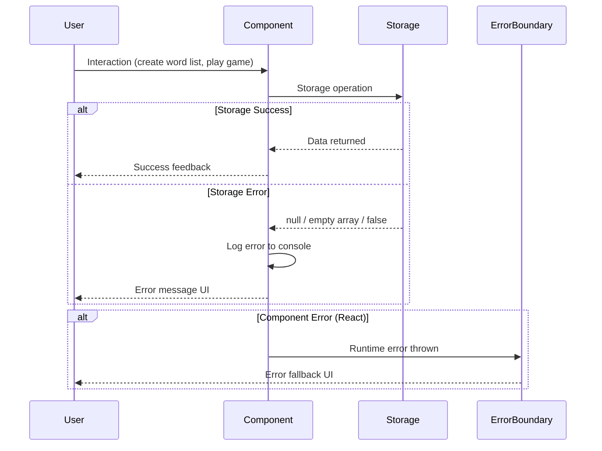

# 13. Error Handling Strategy

## Error Flow



## Error Categories

**Storage Errors:**
- localStorage unavailable (private browsing, quota exceeded)
- Corrupted data (invalid JSON)
- Missing data (key not found)

**Validation Errors:**
- Invalid word format (non-alphabetic characters except spaces)
- Duplicate word list names
- Empty required fields

**Game Session Errors:**
- Missing word lists
- Invalid game mechanic ID
- State machine transition errors

## Frontend Error Handling Patterns

**Storage Layer Pattern:**

```typescript
/**
 * Example from localStorage.ts
 * Returns sensible defaults on error
 */
export function getAllWordLists(): WordList[] {
  if (typeof window === 'undefined') return [] // SSR safety

  try {
    const stored = localStorage.getItem(STORAGE_KEYS.WORD_LISTS)
    if (!stored) return [] // No data = empty array

    const lists: WordList[] = JSON.parse(stored)

    return lists.map(list => ({
      ...list,
      createdAt: new Date(list.createdAt),
      updatedAt: new Date(list.updatedAt),
    }))
  } catch (error) {
    console.error('Error loading word lists:', error)
    return [] // Graceful degradation
  }
}
```

**Component Error Handling:**

```typescript
/**
 * Example from a component using storage
 */
export default function WordListsPage() {
  const [lists, setLists] = useState<WordList[]>([])
  const [error, setError] = useState<string | null>(null)

  useEffect(() => {
    try {
      const loadedLists = getAllWordLists()

      if (loadedLists.length === 0) {
        setLists([])
        setError(null)
      } else {
        setLists(loadedLists)
        setError(null)
      }
    } catch (error) {
      console.error('Failed to load word lists:', error)
      setError('Unable to load word lists. Please refresh the page.')
      setLists([])
    }
  }, [])

  if (error) {
    return (
      <div className="error-container">
        <p className="error-message">{error}</p>
        <Button onClick={() => window.location.reload()}>
          Reload Page
        </Button>
      </div>
    )
  }

  // ... rest of component
}
```

**Validation Error Handling:**

```typescript
/**
 * Example from validation.ts
 */
export function validateWordListInput(input: WordListCreateInput): {
  isValid: boolean
  errors: Record<string, string>
} {
  const errors: Record<string, string> = {}

  if (!input.name?.trim()) {
    errors.name = 'Name is required'
  }

  if (!input.words || input.words.length === 0) {
    errors.words = 'At least one word is required'
  } else {
    const invalidWords = input.words.filter(
      word => !/^[a-zA-Z\s]+$/.test(word.trim())
    )
    if (invalidWords.length > 0) {
      errors.words = `Invalid words: ${invalidWords.join(', ')}`
    }
  }

  return {
    isValid: Object.keys(errors).length === 0,
    errors,
  }
}
```

## Error Messages for Users

| Scenario | User Message |
|----------|-------------|
| Storage unavailable | "Unable to save data. Please check your browser settings." |
| Corrupted data | "Data appears corrupted. Please refresh the page." |
| Validation failure | "Please check: Name is required, Words must contain only letters" |
| Missing word lists | "No word lists found. Create your first list to get started!" |
| Game mechanic error | "Unable to load game. Please try again." |

## React Error Boundaries

**Layout Error Boundary:**

```typescript
// app/error.tsx
'use client'

export default function Error({
  error,
  reset,
}: {
  error: Error & { digest?: string }
  reset: () => void
}) {
  return (
    <div className="error-page">
      <h2>Something went wrong!</h2>
      <p>We encountered an unexpected error.</p>
      <button onClick={() => reset()}>
        Try again
      </button>
    </div>
  )
}
```

---
