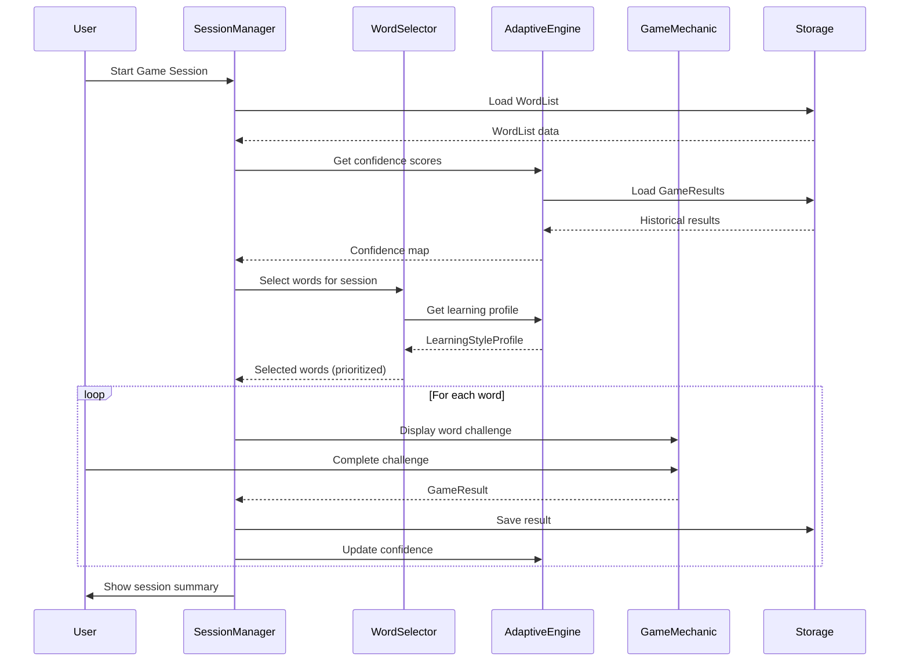
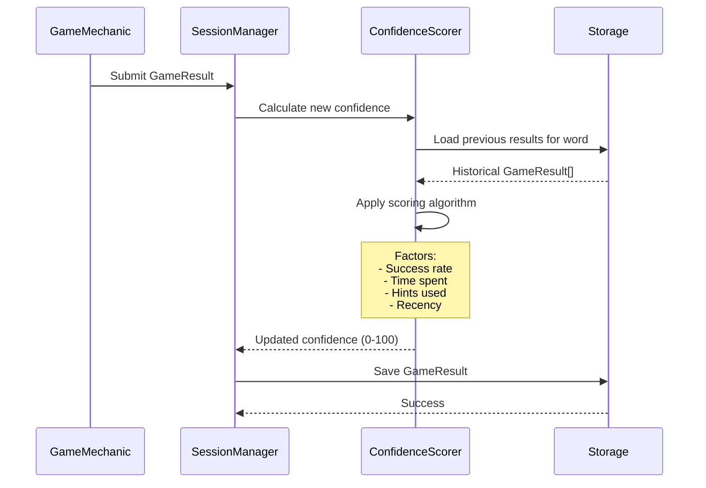
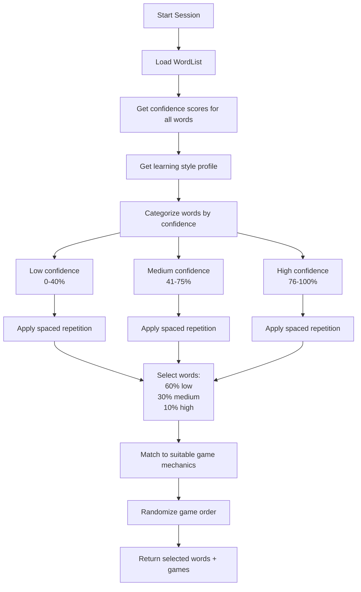
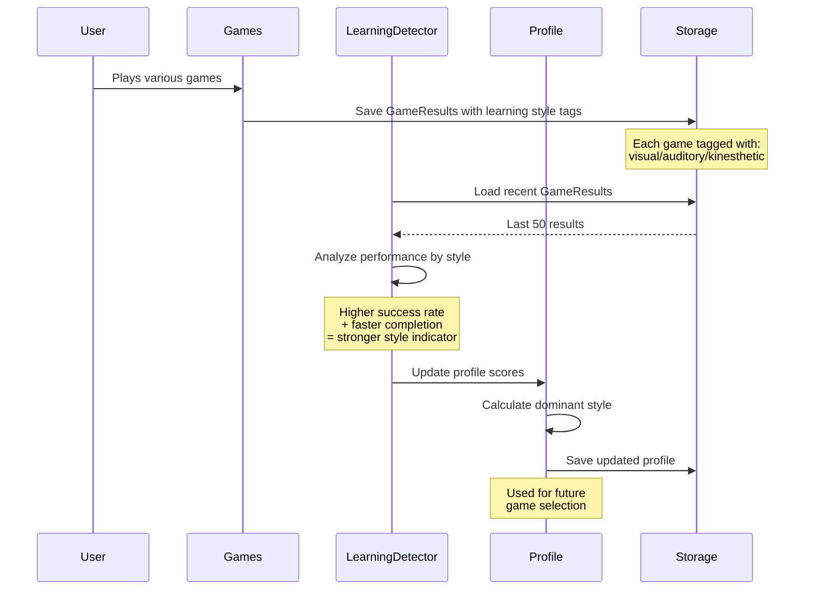
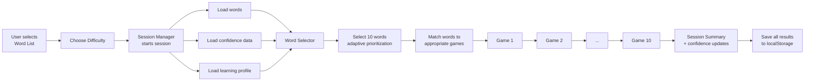

# 6. Core Workflows

## Workflow 1: Adaptive Game Session Flow

## Workflow 2: Confidence Scoring Update

## Workflow 3: Word Selection Algorithm

## Workflow 4: Learning Style Detection

## Workflow 5: Word List to Game Session

---
